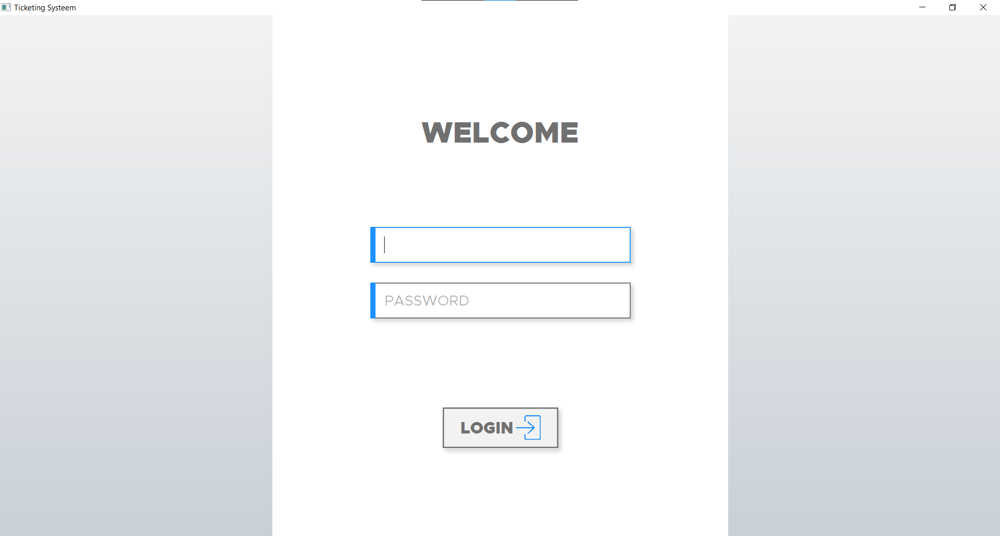
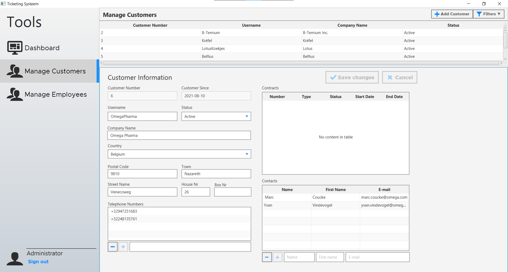
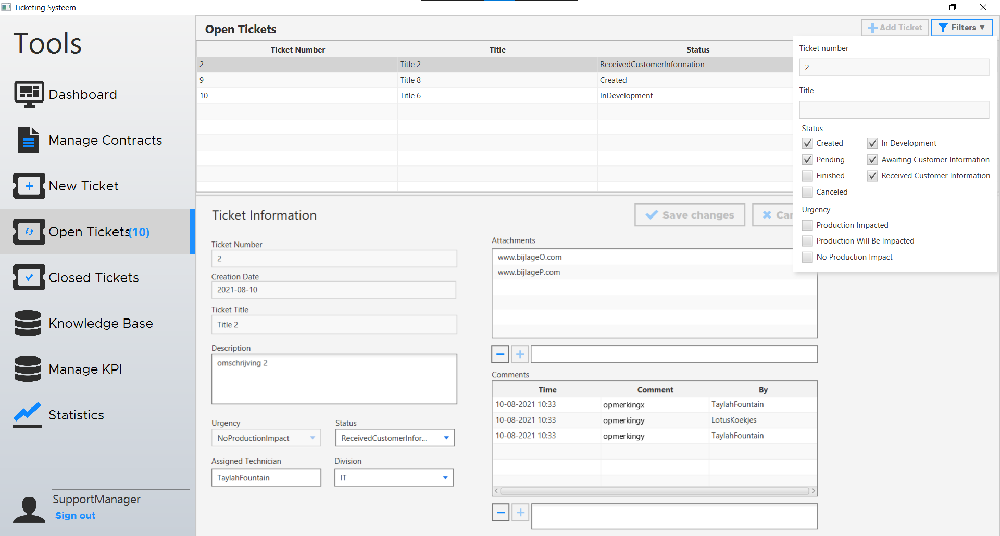
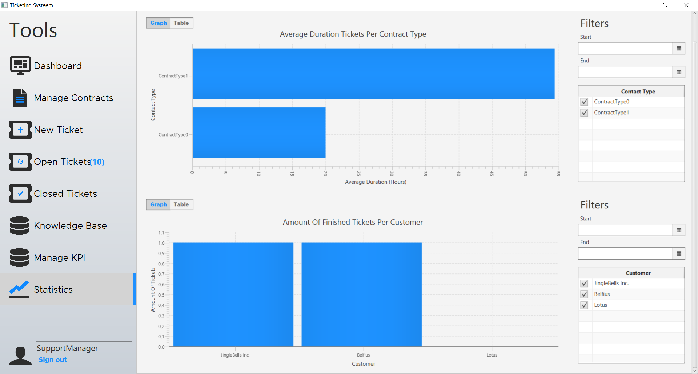

# HoGent-TicketingDesktopApp

A project made for the course Projecten-workshops II at HoGent.
The goal was to design and code a desktop application in Java for managing tickets.

## Pre-Run

Run [DBCreate.sql](sql/DBCreate.sql) in SQL Server Management Studio.

Enable SQL Server Authentication and enable sa login [docs.microsoft](https://docs.microsoft.com/en-us/sql/database-engine/configure-windows/change-server-authentication-mode?redirectedfrom=MSDN&view=sql-server-ver15)

Configure Build Path (Module Path)
- Add JRE JavaSE-14
- Add JUnit 5
- Add [JavaFX](https://gluonhq.com/products/javafx/)
- Add jars from [jars/modulepath](jars/modulepath) (Mockito, Jakarta)

Configure Build Path (Class Path)
- Add jars from [jars/classpath](jars/classpath) (Eclipselink, MsSQL connector, Jakarta.source)

## Logins

| Username       | Pasword    | Contents                                             |
| :------------- | :--------- | :--------------------------------------------------- |
| Administrator  | Wachtwoord | Administrator(Manage people)                         |
| Technieker     | Wachtwoord | Technician(Manage tickets)                           |
| Supportmanager | Wachtwoord | Support manager(Manage contracts/tickets/statistics) |

## Screenshots

